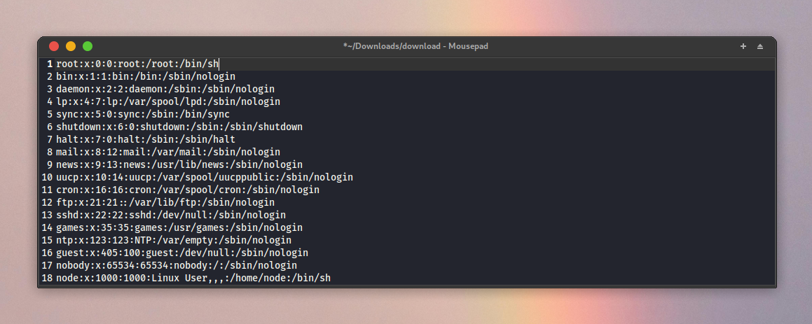
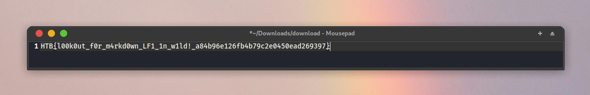

Challenge Name: Armaxis

Challenge Description: In the depths of the Frontier, Armaxis powers the enemy’s dominance, dispatching weapons to crush rebellion. Fortified and hidden, it controls vital supply chains. Yet, a flaw whispers of opportunity, a crack to expose its secrets and disrupt their plans. Can you breach Armaxis and turn its power against tyranny?

Category: Web

Difficulty: Very easy

# Preface

To solve this challenge, you will need to perform Authentication Bypass and Local File Inclusion vulnerabilities. The challenge page provided the option to download files for analysis, which you can obtain via the link: https://github.com/StepQuest/htb-uni-ctf-web-writeup-2024/blob/main/web_armaxis.zip

## Skills Required

* Basic understanding of JavaScript
* HTTP requests interception
* Vulnerability research skills

## Skills Learned

* Analyzing JavaScript code
* Login Authentication Bypass
* Markdown Local File Inclusion

# Challenge Overview

The challenge begins with us being provided two addresses: one hosting a web application called Armaxis with a login form, and another simulating a mailbox.

Here, we see that account registration, login, and password recovery are available.

Here, we see a mailbox belonging to the address `test@email.htb`, which currently has no messages. There's also a button that deletes all messages from the mailbox.

# Curiosities in Code

At an earlier stage, by analyzing the relatively simple JavaScript code, we can identify the existence of the `admin@armaxis.htb` email, which is mentioned in the `/web_armaxis/challenge/views/database.js` file.

# Walkthrough

Perform a password reset for `test@email.htb`

As a result, we will receive a random token in the mailbox, which will need to be used to reset the password.

On the password recovery page, enter the token and a new password. Then, open Burp Suite, click the button to confirm the password change, and intercept the request.

In the intercepted packet, replace `test@mail.htb` with `admin@armaxis.htb`  and forward the package. As a result, we will have successfully changed the password for the admin account.

After logging into the admin account, we are redirected to the `http://site.com/weapons` page, which appears empty. However, we can see that the Dispatch Weapon page is available.

On the Dispatch Weapon page, we see a form with multiple fields. After filling in all the fields with test values, let's check the result.

We receive a table displaying the previously entered values.

By analyzing `/web_armaxis/challenge/views/markdown.js`, we can see that it allows us to insert images. This could potentially be a vulnerability. 

Let's perform a test to disclose the `/etc/passwd` file. First, we need to find the request in Burp Suite's history where we submitted the form with test values.

Replace the value of the `note` field with `` and send the request. In the response, we can see that our "weapon" has been successfully dispatched.

On the weapons table page, let's download our image.

Finally, we open the downloaded image file. As a result, we see the successful exploitation of an LFI vulnerability, displaying the contents of the `/etc/passwd` file. Knowing this, we can easily retrieve our flag.

You can take an alternative approach by using the browser's developer tools. Copy the base64-encoded value of the image and decode it to retrieve the data. Overall, it doesn't matter which method you choose to go with.

# Solution

Repeat the step with modifying the `note` field value, but this time use ``.

After downloading the new image from the table and opening the file, we will obtain our flag.

